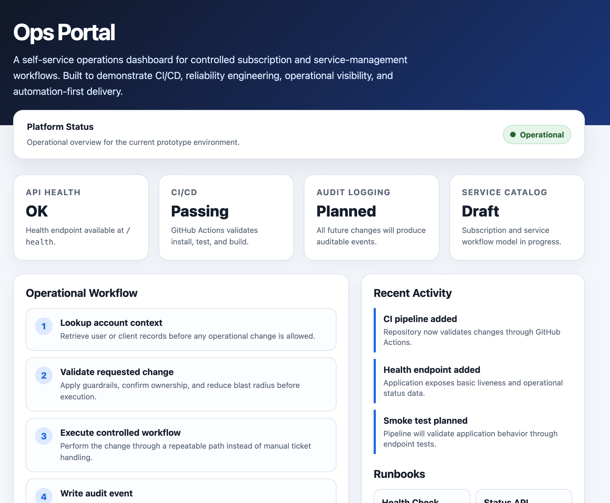

# Self-Service Operations Portal

## Overview

Ops Portal is a sanitized DevOps/platform engineering demo that models a real internal operations workflow: replacing manual ticket-driven API changes with a self-service portal, validation, audit logging, and CI/CD automation.

The project demonstrates how platform teams can reduce operational toil by safely delegating repetitive administrative tasks to controlled self-service workflows.
## Dashboard Preview



## Current Status

This is an actively developed prototype intended to demonstrate DevOps, operations, and reliability engineering practices.

Current capabilities:

- Node/Express application runtime
- Docker-based local runtime support
- GitHub Actions CI pipeline
- Basic npm validation scripts
- Recruiter-facing documentation foundation
## Engineering Focus

This project is intentionally scoped as a DevOps/SRE proof-of-work prototype rather than a feature-complete product.

Current focus areas:

- Reproducible local runtime
- Automated CI validation
- Health and status endpoints
- Smoke testing for operational readiness
- Professional operations dashboard
- Clear roadmap for reliability-focused improvements
## Planned Stack

- Node.js
- Express
- SQLite or PostgreSQL
- Docker / Docker Compose
- GitHub Actions
- Kubernetes manifests
- Basic RBAC
- Audit logging

## MVP Goals

- Lookup client/user records
- View service subscriptions
- Toggle subscriptions safely
- Write all changes to an audit log
- Run locally via Docker Compose

## Running Locally

```bash
npm ci
npm run dev

